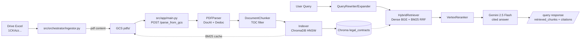

# Legal RAG Engine — French Contract Intelligence

[](https://www.python.org/)
[](https://fastapi.tiangolo.com/)
[](https://cloud.google.com/)
[](https://www.trychroma.com/)
[](#)

Production-grade Retrieval-Augmented Generation (RAG) system for **French legal contracts** (leases, NDAs, construction agreements — *CMAD, EPC, CPE*). Parses scanned PDFs → structure-aware chunking → hybrid retrieval (dense + BM25) → Vertex AI reranking → grounded generation with citations.

> **Public portfolio version:** All GCP project IDs, buckets, and contract data are sanitized. Real evaluation datasets live locally in `data/` (gitignored) — see [Data & Privacy](#data--privacy).

---

## Highlights

- **Legal PDF Parser** — `src/core/parser/` : PyMuPDF + Google Document AI (OCR) + Dedoc microservice for layout, TOC filtering (`chunker.py:30`), clause-aware splitting, table extraction (camelot/pdfplumber).
- **Structure-aware Chunking** — hierarchical `DocumentChunker` with breadcrumb retention, heading-body merging, and `part_number/total_parts` context-window expansion (`src/app/main.py: expand_with_local_context`).
- **Hybrid Retrieval** — `HybridRetriever` dense (BGE embeddings via `BGEEmbedderClient`) + `BM25Okapi` fused via Reciprocal Rank Fusion (`reciprocal_rank_fusion.py`), GCS-cached BM25 index.
- **Vertex AI Reranker** — cross-encoder `semantic-ranker-512-004` (`reranker.py`) over top-60 candidates → top-5.
- **Query Intelligence** — adaptive `QueryAnalyzer` (complexity → `top_k`/`expand`/`rerank`), `QueryRewriter` + `QueryExpander` (Gemini 2.5 Flash).
- **Grounded Generation** — citation-forced prompt (strict French legal assistant), numeric fidelity, refusal for `ABSENT_DU_CONTRAT`.
- **Ingestion at Scale** — Drive Excel → GCS staging → `pubsub/publisher.py` → indexer (`src/app/indexer_main.py` → `Indexer` + `ChromaClient` HNSW `M=128`).

---

## Architecture



---

## Project Structure (Proposal B)

```
.
├── src/
│   ├── app/               # FastAPI entrypoints (main.py, indexer_main.py) + shim symlinks src/main.py
│   ├── config/settings.py # Pydantic-settings (sanitized defaults: your-gcp-project-id)
│   ├── core/parser/       # pdf_parser, structure_extractor, chunker, semantic_enricher
│   ├── core/retrieval/    # hybrid_retriever, reranker, query_* , RRF
│   ├── core/embedding/bge_client.py
│   ├── core/indexer/      # chroma_client, indexer
│   ├── core/storage/gcs.py
│   ├── adapters/          # drive_client, firestore_client, gcs_client
│   ├── api/ + orchestrator/ + static/
│   └── settings.py -> config/settings.py (shim, no code change)
├── deploy/
│   ├── docker/Dockerfile, Dockerfile.bge, Dockerfile.dedoc (+ root symlinks)
│   └── cloudrun/cloud_run_job.yaml (+ deploy/*.yaml symlinks)
├── scripts/
│   ├── eval/evaluate_retrieval.py, evaluate_generation.py
│   ├── linking/link_golden_chunks.py, relink_golden.py
│   └── ops/trigger_parse.py
├── data/                  # gitignored: golden*.jsonl, toc_output.json, eval_cache.json, problematic.txt
├── .env.example           # sanitized template
├── docker-compose.yml     # dedoc + chromadb + app
└── Makefile               # build, deploy-parser/indexer/bge/dedoc (uses $(GCP_PROJECT_ID))
```

---

## Quick Start

```bash
# 1. env
cp .env.example .env  # fill GCP_PROJECT_ID, GCS_BUCKET_NAME, DOCUMENT_AI_PROCESSOR_ID, etc.

# 2. run deps
docker-compose up -d          # chromadb :8000, dedoc :1231
pip install -r requirements.txt

# 3. run API (or indexer)
uvicorn src.app.main:app --host 0.0.0.0 --port 8080
# uvicorn src.app.indexer_main:app --host 0.0.0.0 --port 8080  # Pub/Sub push

# 4. query
curl -X POST http://localhost:8080/query -H 'Content-Type: application/json' \
  -d '{"query":"Quelle est la durée du bail ?","hybrid":true,"rerank":true,"top_k":5,"generate":true}'
```

`docker-compose.yml` mounts `.env` and `sa-key.json` (ignored). Dedoc at `DEDOC_SERVICE_URL=http://dedoc:1231`.

---

## Configuration

All secrets via `.env` — **never commit `.env` or `sa-key.json`**. Defaults in `src/config/settings.py` are `your-gcp-project-id` / `your-gcs-bucket-name`.

```env
GCP_PROJECT_ID=your-gcp-project-id
GCP_LOCATION=europe-west9
GCS_BUCKET_NAME=your-gcs-bucket-name
DOCUMENT_AI_PROCESSOR_ID=your-document-ai-processor-id
CHROMA_HOST=localhost
CHROMA_COLLECTION=legal_contracts
VERTEX_AI_LLM_MODEL=gemini-2.5-flash
PARSER_URL=https://your-parser-service-url
```

See `.env.example` for full list (`BGE_EMBEDDER_URL`, `DEDOC_SERVICE_URL`, `PUBSUB_*`, `HNSW_*`).

---

## Evaluation

Sanitized scripts use `your-parser-service-url` by default, override via `PARSER_URL` env.

```bash
# retrieval (MRR, MAP, Recall@k, nDCG)
python scripts/eval/evaluate_retrieval.py  # reads data/golden_with_chunks_bge.jsonl + data/doc_id_to_site.json

# generation (faithfulness, refusal, numeric, relevance — Gemini judge)
python scripts/eval/evaluate_generation.py --golden data/golden_with_chunks_bge.jsonl --concurrent 5
```

Outputs `results_site.json` / `generation_eval_results_prod.json` → `data/` (ignored).

---

## Deployment (GCP)

```bash
make build                # parser + indexer images to europe-west9-docker.pkg.dev/$(GCP_PROJECT_ID)/...
make deploy-parser        # Cloud Run legal-rag-parser (public, DEDOC_SERVICE_URL, CHROMA_HOST=10.200.0.2)
make deploy-indexer       # Cloud Run legal-rag-indexer (private, Pub/Sub)
make deploy-bge deploy-dedoc
```

`cloudbuild.yaml` → empty (use `make build`). `deploy/cloudrun/cloud_run_job.yaml` is placeholder — real job uses `Makefile deploy-job`.

---

## Data & Privacy

`data/` + `*.jsonl` + `.env` + `sa-key.json` are in `.gitignore:59-78`. Contract excerpts (SIREN, addresses like *Odynéo / Magic Vati* examples) never committed. History was purged (`git init` fresh root commit `0600cbe`). Keep repo **private** if forking.

---

## Tech Stack

FastAPI, Pydantic, Vertex AI (Gemini, Embeddings, Ranker), ChromaDB HNSW, BGE, rank_bm25, PyMuPDF, Document AI, Dedoc, Firestore, GCS, Pub/Sub, Docker, Cloud Run.

---

## License

Private — not for public distribution. Contact owner for access.
